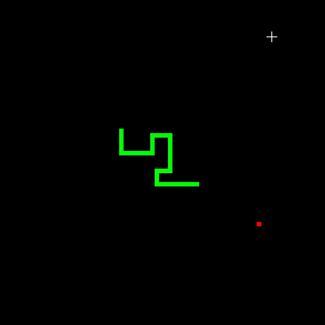

# Snake-Assembly-x86-64-win

This is a snake game written in x86-64 assembly using exclusively the win32 API, not even LIB-C. It was a challenge, and a great experience! (I was able to make the base game in a single day).

